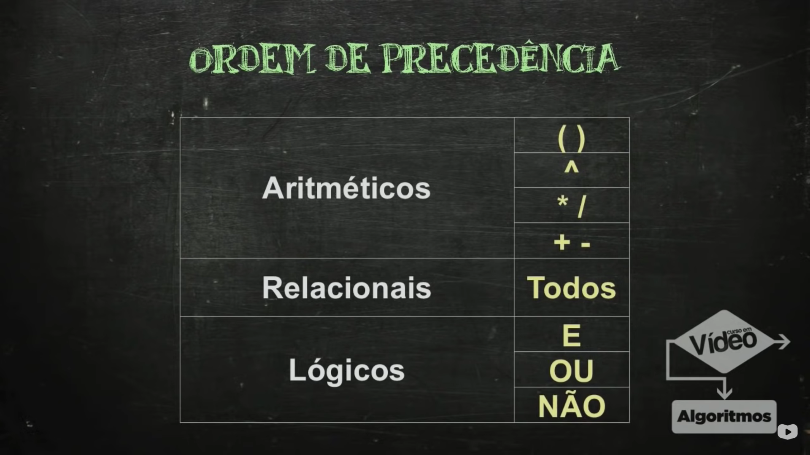

### O que são algorítmos?

Os algorítmos são uma sequência de ações executadas para a solução de um problema. Como por exemplo:

<pre>
<code>
algoritmo atravessarRua
    olhar para a direita
    olhar para a esquerda
    se estiver vindo carro
        não atravesse
    senão
        atravesse
    fim-se
fim-algoritmo
</code>
</pre>

### Algorítmos computacionais

Os algorítmos computacionais são desenvolvidos através de 3 fases:

<ul>
    <li>Lógica de programação</li>
    <li>Linguagem de programação</li>
    <li>Sistema completo</li>
</ul>

A lógica de programação é estruturada através de uma linguagem para construir um sistema completo.

### Portugol

O portugol é uma maneira de representar a lógica de programação para converter para uma linguagem.

Através do programa <strong>VisuAlg</strong>, foi possível desenvolver esse meu primeiro código:

<pre>
<code>
algoritmo "primeiro-comando"
var
inicio
    Escreva ("Ola, mundo!")
fimalgoritmo
</code>
</pre>

Como resultado, eu tive a mensagem: <i>Ola, mundo!</i>

### Outros comandos

#### Texto em uma nova linha:

<pre>
<code>
    escreval ("Linha de cima")
    escreva ("Linha de baixo")
</code>
</pre>

<strong>Resultado:</strong>
<i>Linha de cima 
Linha de baixo</i>

### Variáveis

#### Identificadores
Os identificadores são as palavras que definem a variável. Devem começar com uma letra e não podem ter símbolos (com exceção do underline (_)) ou espaços, também não podem ter o mesmo nome das palavras reservadas ("inicio", "var", "algoritmo", etc).

<strong>Exemplos:</strong> teste1, nome_teste, algoritmos_saoLegais

#### Tipos Primitivos
<ol>
<li><strong>Inteiro:</strong> 1, 200, -89, 0</li>
<li><strong>Real:</strong> 0.5, 2.75, -35.6</li>
<li><strong>Caractere:</strong> "Teste", "Isso é um texto", "Algoritmos"</li>
<li><strong>Lógico:</strong> verdadeiro, falso</li>

#### Exemplo de atribuição de variável
<pre>
<code>
algoritmo "segundo"
var
    nome: caractere
inicio
    nome <- "Renato"
    escreva ("Olá, o meu nome é " + nome)
fimAlgoritmo
</code>
</pre>

### Comandos de entrada

<pre>
<code>
algoritmo "olaNome"
var
    nome: caractere
inicio
    escreva ("Olá, o seu nome é: )
    leia (nome)
    escreva ("Muito prazer, " + nome)
fimAlgoritmo
</code>
</pre>

<strong>leia</strong> é um comando de entrada 
<strong>escreva</strong> é um comando de saída

### Operadores Aritméticos

São operadores aritméticos aqueles que são usados para realizar contas matemáticas, como adição ( + ), subtração ( - ), multiplicação ( * ), divisão ( / ), divisão inteira ( \ ), exponênciação ( ^ ) e resto da divisão ( % ).

Alguns exemplos:

<pre>
<code>
algoritmo
var
    a, b: inteiro
inicio
    a <- 5
    b <- 2
    escreva(a+b) <i>//adição</i>
    escreva(a-b) <i>//subtração</i>
</code>
</pre>

#### Soma de valores

<pre>
<code>
algoritmo "soma"
var
    numero1, numero2, soma: inteiro
inicio
    escreva ("Digite o primeiro número: ")
    leia (numero1)
    escreva ("Digite o segundo número: ")
    leia (numero2)
    soma <- numero1 + numero2
    escreva ("A soma entre ",numero1," e ",numero2," é igual a ", soma)
fimAlgoritmo
</code>
</pre>

#### Exemplo de uma equação em algorítmos
<pre>
<code>
algoritmo "equacao"
var
    resultado: real
inicio
    resultado <- (7 + 3) / 5
    escreva(resultado)
fimAlgoritmo
</code>
</pre>

### Operadores relacionais

Os operadores relacionais são aqueles que determinam se tal operação é verdadeira ou falsa. São eles: maior que ( > ), menor que ( < ), maior ou igual a ( >= ), menor ou igual a ( <= ), igual a ( = ), diferente ( <> ).

Alguns exemplos:

<pre>
<code>
algoritmo
var
    a, b: inteiro
inicio
    a <- 10
    b <- 5
    escreva(a>b) <i>//TRUE</i>
    escreva(a+b=b%2) <i>//FALSE</i>
fimAlgoritmo
</code>
</pre>

### Operadores Lógicos

Os operadores lógicos comparam dois valores e determinam se o resultado é verdadeiro ou falso através dos operadores E e OU.

<pre>
<code>
algoritmo
var
    a, b: inteiro
inicio
    a <- 10
    b <- 5
    escreva((a>b) e (b<>a)) <i>//TRUE - porque as duas operações são verdadeiras</i>
    escreva((a/b = 2) ou (a/b = 3)) <i>//TRUE - porque uma das operações é verdadeira</i>
    escreva ((a=b) ou (b>=10)) <i>// FALSE - porque as duas operações estão incorretas</i>
fimAlgoritmo
</code>
</pre>

### Ordem de Precedência

<a href="https://youtu.be/Ig4QZNpVZYs?t=1000" target="_blank">Print tirado dessa vídeoaula</a>

### Exemplo de Código com todas as Operações

<pre>
<code>
algoritmo "temperatura"
var
     t1, t2, t3: real
     geral: logico
inicio
      escreval("Qual era a temperatura de manhã? ")
      leia(t1)
      escreval("Qual era a temperatura de tarde? ")
      leia(t2)
      escreval("Qual era a temperatura de noite? ")
      leia(t3)
      geral <- (t1>15) e (t2>20) e (t3>15)
      escreva("Hoje o dia estava quente? ", geral)
fimalgoritmo
</code>
</pre>

#### Algorítmo Calculador de Idade

<pre>
<code>
algoritmo "minha-idade"
var
   anoAtual, anoNascimento, idade: inteiro
inicio
      escreva("Em que ano estamos? ")
      leia (anoAtual)
      escreva ("Em que ano eu nasci? ")
      leia (anoNascimento)
      idade <- (anoAtual - anoNascimento)
      escreva("Então a minha idade é ", idade ,"!")
fimalgoritmo
</code>
</pre>

<strong>Dica de ouro:</strong> uma ótima ferramenta para práticar algorítmos de forma dinâmica e animada é o <strong><a href="https://scratch.mit.edu/download">Scratch</a></strong>.

#### Algorítmo Conversor de Reais em Dollares

<pre>
<code>
algoritmo "conversor-dollar"
var
   valorDollar, quantiaReais, quantiaPossivel: real
inicio
      escreva("Vou para os Estados Unidos. Quanto o dollar está valendo hoje? ")
      leia (valorDollar)
      escreva ("Quantos reais eu tenho? ")
      leia (quantiaReais)
      quantiaPossivel <- quantiaReais  / valorDollar
      escreva("Então eu consigo comprar US$ " , quantiaPossivel , ".")
fimalgoritmo
</code>
</pre>

#### Algorítmo Conversor de Temperatura

<pre>
<code>
algoritmo "conversor-temperatura"
var
   temperaturaF, temperaturaC: real
inicio
      escreva("A temperatura local está quantos graus em fahrenheit? ")
      leia (temperaturaF)
      temperaturaC <- (temperaturaF - 32) / 1.8
      escreva ("Então aqui está ",temperaturaC:4:1," graus em celsius.")
fimalgoritmo
</code>
</pre>

#### Algorítmo de Cálculo de Taxa de Importação

<pre>
<code>
algoritmo "taxa-importacao"
var
   valorObjeto, taxa, valorTaxado: real
inicio
      escreva("Quanto custa o objeto que comprei?" )
      leia (valorObjeto)
      escreva("Qual é a taxa de importação?" )
      leia(taxa)
      valorTaxado <- (valorObjeto * taxa) / 100
      escreva ("Então eu pagarei ",valorTaxado:5:2,".")
fimalgoritmo
</code>
</pre>

#### Algorítmo Calculador de Parcelas de Empréstimo

<pre>
<code>
algoritmo "emprestimo"
var
   taxa, emprestimo, valorParcelado: real
   parcelas: inteiro
inicio
      escreva("Qual é a taxa de juros para empréstimos nesse banco? ")
      leia(taxa)
      escreva("Quanto você precisa de empréstimo? R$ ")
      leia (emprestimo)
      escreva("Em quantas parcelas você deseja pagar? ")
      leia(parcelas)
      valorParcelado <- (emprestimo + ((emprestimo * taxa)) / 100) / parcelas
      escreva ("Então você pagará ",parcelas," parcelas de R$ ",valorParcelado,".")
fimalgoritmo
</code>
</pre>

## Estruturas Condicionais

As estruturas conficionais são baseadas no fluxo: condição => expressão => resultado. Utilizamos os termos <strong>SE</strong> e <strong>SENÃO</strong> para abrir a condição, logo depois definimos ela através de uma expressão e, com isso, programamos o resultado. Exemplos:

#### Estrutura Simples (SE / IF)

<i>Se eu tiver dinheiro, então comprarei um carro."</i>

O algorítmo dessa expressão seria assim:

<pre>
<code>
algoritmo "se"
var
   resposta: caractere
inicio
    escreva("Eu tenho muito dinheiro? S/N? ")
    leia(resposta)
    se(resposta = "S") entao
        escreva("Então comprarei um carro.")
    fimse
fimalgoritmo
</code>
</pre>

#### Estrutura Composta (SE SENÃO / IF ELSE)

Agora um pouco diferente:

<i>Se eu tiver dinheiro, então comprarei um carro. Senão tiver, comprarei uma bicicleta"</i>

O algorítmo dessa expressão seria assim:

<pre>
<code>
algoritmo "se"
var
   resposta: caractere
inicio
    escreva("Eu tenho muito dinheiro? S/N? ")
    leia(resposta)
    se(resposta = "S") entao
        escreva("Então comprarei um carro.")
    senao
        escreva("Então comprarei uma bicicleta.")
    fimse
fimalgoritmo
</code>
</pre>

### Exemplos de Estruturas Condicionais

#### Par ou Ímpar?

<pre>
<code>
algoritmo "par-impar"
var
    numero: inteiro
inicio
    escreva("Digite um número: ")
    leia(numero)
    se(numero % 2 = 0) entao
        escreval("O número ",numero," é par.")
    senao
        escreval("O número ",numero," é ímpar.")
    fimse
fimalgoritmo
</code>
</pre>

#### Cálculo de IMC

<pre>
<code>
algoritmo "calculo-imc"
var
   altura, massa, imc: real
inicio
      escreva("Qual é sua altura em metros? ")
      leia(altura)
      escreva("Qual é sua massa em kg? ")
      leia(massa)
      imc <- massa / (altura ^ 2)
      se((imc > 18.5) e (imc < 25)) entao
           escreval("O seu IMC é de ",imc:2:1,". Você está no peso ideal.")
      senao
           escreval("O seu IMC é de ",imc:2:1,". Você não está no peso ideal.")
      fimse
fimalgoritmo
</pre>
</code>

#### Habilitação: Apto ou Inapto?

<pre>
<code>
algoritmo "cnh"
var
   anoAtual, anoNascimento, idade: inteiro
inicio
      escreval("--------------------------")
      escreval(" DEPARTAMENTO DE TRANSITO")
      escreval("--------------------------")
      escreva("Ano Atual (yyyy): ")
      leia(anoAtual)
      escreva("Ano de Nascimento (yyyy): ")
      leia(anoNascimento)
      idade <- anoAtual - anoNascimento
      escreval(" ")
      escreval("----------STATUS----------")
      escreval(" IDADE: ",idade," ANOS")
      se(idade >= 18) entao
           escreva(" APTO A TIRAR CARTEIRA")
      senao
           escreval(" INAPTO A TIRAR CARTEIRA")
      fimSe
      escreva("--------------------------")
fimalgoritmo
</pre>
</code>

#### Aluno Aprovado ou Reprovado?

<pre>
<code>
algoritmo "nota"
var
   nota1, nota2, media: real
inicio
      escreva("Primeira Nota: ")
      leia(nota1)
      escreva("Segunda Nota: ")
      leia(nota2)
      media <- (nota1 + nota2) / 2
      escreval(" MEDIA: ",media:2:1)
      se(media >= 7) entao
           escreval(" ALUNO APROVADO")
      senao
           escreval(" ALUNO REPROVADO")
      fimSe
fimalgoritmo
</pre>
</code>

### Condicionais Aninhadas

Essas condicionais são foramdas por mais de uma condição, mais de um SE.

<pre>
<code>
algoritmo "nota"
var
    nota1, nota2, media: real
inicio
    escreva("Primeira Nota: ")
    leia(nota1)
    escreva("Segunda Nota: ")
    leia(nota2)
    media <- (nota1 + nota2) / 2
    escreval(" MEDIA: ",media:2:1)
    se(media >= 7) entao
        escreval(" ALUNO APROVADO")
    senao
        se (media < 7) e (media > 4) entao
            escreval(" ALUNO EM RECUPERAÇÃO")
        senao
            escreval(" ALUNO REPROVADO")
        fimSe
    fimSe
fimalgoritmo
</code>
</pre>

#### Aproveitamento Escolar

<pre>
<code>
algoritmo "aproveitamento"
var
    nota1, nota2, nota3, media: real
inicio
    escreva("Primeira nota: ")
    leia(nota1)
    escreva("Segunda nota: ")
    leia(nota2)
    escreva("Terceira nota: ")
    leia(nota3)
    media <- (nota1 + nota2 + nota3) / 3
    escreval("Sua media é: ",media:2:1)
    se (media >= 9) entao
        escreva("Aproveitamento: A")
    senao
        se (media < 9) e (media >= 8) entao
            escreva("Aproveitamento: B")
        senao
            se (media < 8) e (media >= 7) entao
                escreva("Aprovetamento: C")
            senao
                se (media < 7) e (media >= 6) entao
                    escreva("Aproveitamento: D")
                senao
                    se (media < 6) e (media >= 5) entao
                        escreva("Aproveitamento: E")
                    senao
                        escreva ("Aproveitamento: F")
                    fimse
                fimse         
            fimse 
        fimse
    fimse
fimalgoritmo
</code>
</pre>

### Condicionais com Estrutura ESCOLHA CASO

#### Doação

<pre>
<code>
algoritmo "doacao"
var
    digito, valor: inteiro
inicio
    escreval("Faça uma doação!")
    escreval("Para doar R$ 10,00 digite [1]")
    escreval("Para doar R$ 15,00 digite [2]")
    escreval("Para doar outro valor digite [3]")
    escreval("Para cancelar a doação, digite [4]")
    leia(digito)
    escolha digito
            caso 1
                escreva("Obrigado! Você doou R$ 10,00.")
            caso 2
                escreva("Obrigado! Você doou R$ 15,00.")
            caso 3
                escreva("Quanto deseja doar? ")
                leia(valor)
                escreva("Obrigado! Você doou R$ ", valor,",00.")
            caso 4
                escreva("Que pena! Você não doou nada. =(")
    fimEscolha
fimalgoritmo
</code>
</pre>

#### Diferença de Gols

<pre>
<code>
algoritmo "aproveitamento"
var
    time1, time2, diferenca: inteiro
inicio
    escreva("Gols do primeiro time: ")
    leia(time1)
    escreva("Gols do segundo time: ")
    leia(time2)
    se (time1 > time2) entao
        diferenca <- time1 - time2
    senao
        diferenca <- time2 - time1
    fimse
    escreval("A diferença  foi de ",diferenca," gols.")
    escolha diferenca
            caso 0
                escreva("Foi um empate")
            caso 1, 2, 3
                escreva("Foi uma partida normal")
            caso > 3
                escreva("Foi goleada")
    fimEscolha
fimalgoritmo
</code>
</pre>

### Estruturas de Repetição (Loopings)

As estruturas de repetição tem por objet48ivo repetir uma ação toda vez que sua condição for válida, por exemplo: enquanto a comida estiver fria, esquentar mais um minuto no fogo.

<pre>
<code>
algoritmo "aumentando-temperatura"
var
    temperatura: inteiro
inicio
    temperatura <- 20
    enquanto (temperatura <= 30) faca
        escreval(temperatura)
        temperatura <- temperatura + 1
    fimEnquanto
    escreval("A temperatura está ideal.")
fimalgoritmo
</code>
</pre>

#### Contando a partir de um número

<pre>
<code>
algoritmo "contando"
var
    valor, salto, conta: inteiro
inicio
    conta <- 1
    escreva("Até quanto você quer contar? ")
    leia(valor)
    escreva("De quanto em quanto? ")
    leia(salto)
    enquanto (conta <= valor) faca
        escreval(conta)
        conta <- conta + salto
    fimEnquanto
    escreval("Pronto, contei até ",valor," de ",salto," em ",salto,"!")
fimalgoritmo
</code>
</pre>

#### Calculadora de soma

<pre>
<code>
algoritmo "calculadora-soma"
var
    quantValores, cont, soma, numero:inteiro
inicio
    cont <- 1
    soma <- 0
    escreval("Quantos valores você deseja somar? ")
    leia(quantValores)
    enquanto (cont <= quantValores) faca
        escreva("Digite o ",cont,"º valor: ")
        leia(numero)
        cont <- cont + 1
        soma <- soma + numero
    fimenquanto
    escreval("A soma desses valores é igual a ",soma, "! =D")
fimalgoritmo
</code>
</pre>

#### Calculadora de Gastos

<pre>
<code>
algoritmo "calculadora-de-gastos"
var
    quantItens, cont, soma, valor, maior,menor:inteiro
inicio
    cont <- 1
    soma <- valor
    escreval("[-$-$-$-] CALCULADORA DE GASTOS [-$-$-$-]")
    escreval("")
    escreva("Digite o número de itens você comprou: ")
    leia(quantItens)
    enquanto (cont <= quantItens) faca
        escreva("Digite o valor do ",cont,"º item: R$ ")
        leia(valor)
        se (valor > maior) entao
           maior <- valor
        fimse
        se (menor = 0) ou (valor < menor) entao
           menor <- valor
        fimse
        cont <- cont + 1
        soma <- soma + valor
    fimenquanto
    escreval("No total, você teve um gasto de R$ ",soma,".")
    escreval("O item mais caro custou R$ ",maior,".")
    escreval("O item mais barato custou R$ ",menor,".")
fimalgoritmo
</code>
</pre>

#### Contagem Inteligente

<pre>
<code>
algoritmo "contando"
var
comeco, fim, conta: inteiro
inicio
escreval("CONTAGEM INTELIGENTE")
escreval("--------------------")
escreva("Inicio: ")
leia(comeco)
escreva("Fim: ")
leia(fim)
conta <- comeco
escreval("--------------------")
escreval("  C O N T A N D O  ")
escreval("--------------------")
se(fim > comeco) entao
   enquanto (conta <= fim) faca
      escreva(conta,"..  ")
      conta <- conta + 1
   fimEnquanto
senao
   enquanto (conta >= fim) faca
      escreva(conta,"..  ")
      conta <- conta - 1
   fimEnquanto
fimse
fimalgoritmo
</code>
</pre>

#### Melhor Nota

<pre>
<code>
algoritmo "contando"
var
notaAluno, maiorNota: real
totalAlunos, conta: inteiro
nomeAluno, melhorAluno: caractere
inicio
escreva("Número de alunos na turma: ")
leia(totalAlunos)
conta <- 1
enquanto (conta <= totalAlunos) faca
    escreval("--------------------------")
    escreval("ALUNO ",conta)
    escreva("Nome do aluno: ")
    leia(nomeAluno)
    escreva("Nota de ",nomeAluno,": ")
    leia(notaAluno)
    se(notaAluno > maiorNota) entao
        maiorNota <- notaAluno
        melhorAluno <- nomeAluno
   fimse
   conta <- conta + 1
fimEnquanto
escreval("--------------------------")
escreva("O melhor aproveitamento foi de ",melhorAluno," com a nota ",maiorNota)
fimalgoritmo
</code>
</pre>

### Usando o comando REPITA

Ao usar o REPITA, estamos trabalhando com uma estrutura de repetição de forma inversa, onde a condição vem após a execução do bloco.

<pre>
<code>
algoritmo "repita1"
var
cont: inteiro
inicio
cont <- 1
repita
      escreval(cont)
      cont <- cont + 1
ate(cont >10)
fimalgoritmo
</code>
</pre>

#### Tabuada

<pre>
<code>
algoritmo "tabuada"
var
cont, numero, resultado: inteiro
inicio
escreva("Deseja ver a tabuada de qual número? ")
leia(numero)
cont <- 1
repita
      resultado <- numero * cont
      escreval(numero," x ",cont," = ",resultado)
      cont <- cont + 1
ate(cont >10)
fimalgoritmo
</code>
</pre>

#### Números Negativos

<pre>
<code>
algoritmo "numerosNegativos"
var
cont, quantNumeros, numerosNegativos, numero: inteiro
inicio
escreva("Quantos numeros você irá consultar? ")
leia(quantNumeros)
cont <- 1
numerosNegativos <- 0
repita
escreva("Digite um número: ")
leia(numero)
se(numero > 0)entao
          numerosNegativos <- numerosNegativos + 1
fimse
cont <- cont + 1
ate(cont >quantNumeros)
escreva("Você digitou um total de ", numerosNegativos, " números negativos.")
fimalgoritmo
</code>
</pre>

#### Fatorial

<pre>
<code>
algoritmo "fatorial"
var
      numero, conta, fatorial: inteiro
inicio
    escreva("Digite o número que deseja fatoriar: ")
    leia(numero)
    conta <- numero
    fatorial <- 1
    repita
    fatorial <- fatorial * conta
    conta <- conta - 1
    ate(conta < 1)
    escreva("O fatorial de ", numero, " é ", fatorial)
fimalgoritmo
</code>
</pre>

### Estruturas de Repetição: PARA (FOR)

Essa estrutura de repetição se baseia em determinar o caminho que o algortmo deve seguir com o seu resultado em seguida:

<pre>
<code>
algoritmo "valoresPares"
var
    cont, valor: inteiro
inicio
    escreva("Digite um valor: ")
    leia(valor)
    se(valor % 2 = 1) entao
        valor <- valor - 1
    fimSe
    para cont <- valor ate 0 passo -2 faca
        escreval(cont)
    fimpara
</code>
</pre>

#### Números entre 0 e 10

<pre>
<code>
algoritmo "numerosEntre0e10"
var
cont, valor, totalNumeros: inteiro
inicio
totalNumeros <- 0
numerosImpares <- 0
para cont <- 1 ate 5 faca
   escreva("Digite um valor: ")
   leia(valor)
   se((valor >= 0) e (valor<= 10)) entao
      totalNumeros <- totalNumeros + 1
   fimSe
   se(totalNumeros % 2 = 1) entao
      numerosImpares <- numerosImpares + numerosImpares
   fimSe
fimPara
escreva(totalNumeros)
fimalgoritmo
</code>
</pre>

#### Combinações com Para

<pre>
<code>
algoritmo "combinacoes"
var
combinacao1, combinacao2: inteiro
inicio
</code>
</pre>

#### Sequência de Fibonacci

<pre>
<code>
algoritmo "sequenciaFibonacci"
var
n1, n2, n3, seq: inteiro
inicio
n1 <- 0
escreval(n1)
n2 <- 1
para seq := 3 ate 15 faca
    n3 <- n1 + n2
    escreval(n3)
    n1 <- n2
    n2 <- n3
fimPara
fimalgoritmo
</code>
</pre>

#### Analisador de Valores

<pre>
<code>
algoritmo "analisadorValores"
var
cont, valor: inteiro
inicio
cont <- 1
para cont := 1 ate 5 faca
   escreva("Digite o ",cont,"º valor: ")
   leia(valor)
   somaValores <- valor + valor
fimPara
escreva("A soma
fimalgoritmo
</code>
</pre>

### Procedimentos

Os procedimentos guardam uma função e podem ser chamados várias vezes durante o algorítmo, são conhecidos também como <i>callbacks</i>.

<pre>
<code>
algoritmo "detectorPesado"
var
    i: inteiro
    nome, pesado: caractere
    peso, maiorPeso: real

procedimento topo()
inicio
    limpatela
    escreval("Maior peso até agora: ",maiorPeso,"Kg")
fimProcedimento

inicio
topo()
para i <- 1 ate 5 faca
    escreva("Nome: ")
    leia(nome)
    escreva("Peso: ")
    leia(peso)
    se(peso > maiorPeso) entao
        maiorPeso <- peso
        pesado <- nome
    fimSe
    limpaTela
    topo()
fimPara
topo()
escreval("A pessoa mais pesada foi: ",pesado,", com ", maiorPeso ,"Kg.")
fimalgoritmo
</code>
</pre>

#### Par ou Ímpar com Procedimento

<pre>
<code>
algoritmo "parImpar"
var
n: inteiro

procedimento parOuImpar(x: inteiro)
inicio
se(x % 2 = 0) entao
    escreva("Esse número é par!")
senao
    escreva("Esse número é ímpar!")
fimse
fimprocedimento

inicio
escreva("Digite um número: ")
leia(n)
parOuImpar(n)
fimalgoritmo
</code>
</pre>

#### Escopo

As variáveis de escopo GLOBAL, podem ser aplicadas em todo o algorítmo. As variáveis de escopo LOCAL, só podem ser aplicadas dentro de um procedimento. 

#### Passagem por Valor e por Referência

Por valor: o valor é copiado para o parâmetro

Por referência: o parâmetro altera diretamente na variável original.

Exemplo:

<pre>
<code>
algoritmo "somaParametrosReferencia"
var
x, y: inteiro

procedimento soma(var a, b: inteiro) // se tirar o "var", a passagem passa a ser por valor e a variável original não é alterada
inicio
    a <- a + 1
    b <- b + 2
    escreval("Valor de A = ", a)
    escreval("Valor de B = ", b)
    escreval("Soma A + B = ", a + b)
    fimprocedimento

inicio
    x <- 4
    y <- 8
 soma(x,y)
    escreval("Valor de X = ", x)
    escreval("Valor de y = ", y)
fimalgoritmo
</pre>
</code>

#### Sequência de Fibonacci com Procedimento

<pre>
<code>
algoritmo "sequenciaFibonacciProcedimento"
var
n1, n2, n3, seq: inteiro

procedimento fibonacci(var a, b: inteiro)
var
    c: inteiro
inicio
    c <- a + b
    escreval(c)
    a <- b
    b <- c
fimprocedimento
inicio
    n1 <- 0
    escreval(n1)
    n2 <- 1
    para seq := 3 ate 15 faca
        fibonacci(n1,n2)
    fimPara
fimalgoritmo
</code>
</pre>

### Funções

As funções, assim como os procedimentos, são guardadas fora do algorítmo e podem retornar seu resultado no momento em que chamamos por ela no algorítmo.

<pre>
<code>
algoritmo "funcaoSoma"
var
    valor1, valor2, resultado: inteiro
funcao soma(a,b: inteiro):inteiro
retorne a + b
fimfuncao
inicio
    escreva("Digite o primeiro valor: ")
    leia(valor1)
    escreva("Digite o segundo valor: ")
    leia(valor2)
    resultado <- soma(valor1, valor2)
    escreva(resultado)
fimalgoritmo
</code>
</pre>

#### Função de Par ou Ímpar

<pre>
<code>
algoritmo "funcaoParImpar"
var
    numero: inteiro
    resultado: caractere
funcao verificador(a: inteiro):caractere
inicio
se (a % 2 =0) entao
    retorne "Esse número é par!"
senao
    retorne"Esse número é ímpar!"
fimse
fimfuncao
inicio
    escreva("Digite um número: ")
    leia(numero)
    resultado <- verificador(numero)
    escreva(resultado)
fimalgoritmo
</code>
</pre>

#### Função de Fatoriais

<pre>
<code>
algoritmo "fatorialFuncao"
var
    numero, resultado: inteiro
funcao fatorial(a: inteiro):inteiro
    var c, f: inteiro
inicio
    f <- 1
    para c <- 1 ate a faca
        f <- f * c
    fimpara
    retorne f
fimfuncao
inicio
    escreva("Digite um número: ")
    leia(numero)
    resultado <- fatorial(numero)
    escreva("O fatorial de ",numero," é ",resultado)
fimalgoritmo
</code>
</pre>